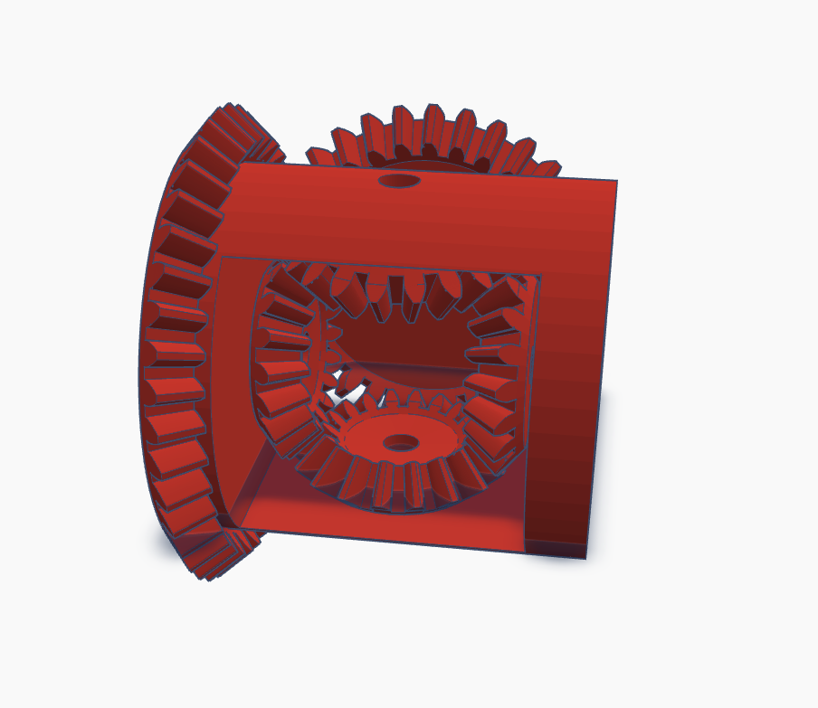

# 3D Models
Our vehicle primarily uses custom 3D-printed components.

## Mechanic Gear

## Differential

The 3D model includes five gear and a holder.

**Size:** 35 x 42 x 42 mm
**Hole diameters:** 3.5mm
**Gear teeth:** 18 (Small), 32 (Motor), 40 (Holder)

## Testing Item

### Hole Tester

The 3D model includes six different hole sizes to test our 3D printer and determine the optimal hole diameter for printing.

  
**Size:** 65 × 8 × 10 mm  
**Hole diameters:** 3.0 mm, 3.1 mm, 3.2 mm, 3.3 mm, 3.4 mm, 3.5 mm  

We found that the 3.5 mm hole works best for most prints. For parts that need to be fixed, we use 495 super glue to attach them to metal mechanical parts. For other assemblies, we mainly use 30 mm M3 screw, 60 mm M3 screw, and 900 mm LM shafts (diameter 3 mm).